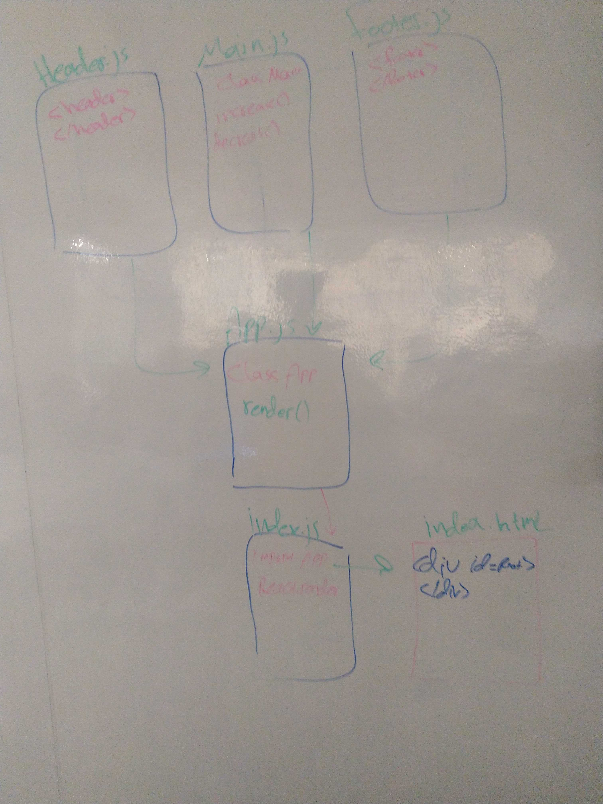

# LAB - Class 27

## React Testing and Deployment

### Author: Ibrahim/Naseem

### Links and Resources

* [submission PR](https://github.com/401-advanced-javascript-ibrahim/lab27/pull/1)
* [ci/cd](https://github.com/401-advanced-javascript-ibrahim/lab27/actions) (GitHub Actions)
* [front-end application](https://401-advanced-javascript-ibrahim.github.io/lab27/)

### Setup

#### How to initialize/run your application (where applicable)

* `npm run start` 

#### Tests

* How do you run tests?
* `npm run test` 
- The test work localy just fine, but it fails on github actions

#### UML

